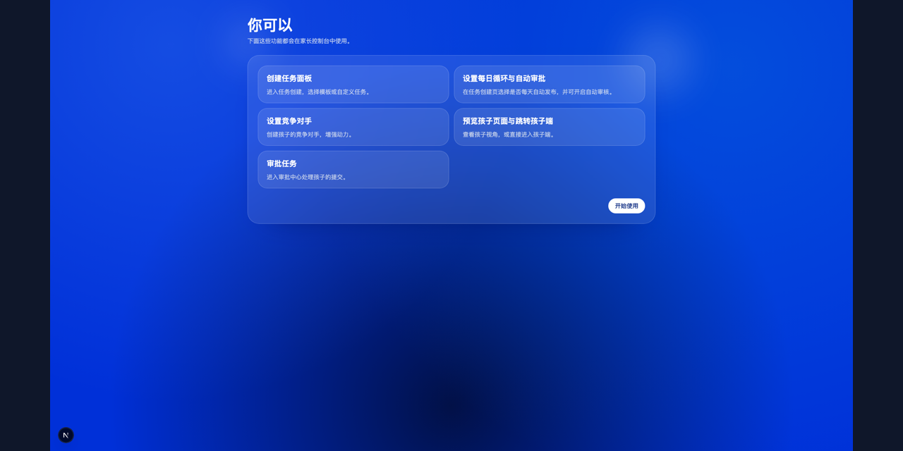

# Show the Work | Technical Product Manager Portfolio

Public portfolio tailored for the **Technical Product Manager (Devices & Infrastructure)** role at **Solink**.

This repository demonstrates platform-level product leadership across strategy, reliability, security, and execution.

## Portfolio Cover

If the image is not visible yet, export `artifacts/COVER_TEMPLATE.svg` to `artifacts/cover.png`.

## 90-120s Demo

- Demo video: `artifacts/demo.mp4`
- Storyboard: [artifacts/VIDEO_STORYBOARD.md](artifacts/VIDEO_STORYBOARD.md)
- Current demo is captured from a live local run of the app.

## Screenshot Gallery

Add screenshots to `artifacts/screenshots/` using the checklist:
[artifacts/SCREENSHOT_CHECKLIST.md](artifacts/SCREENSHOT_CHECKLIST.md)
- Current screenshots are captured from a live local run of the app.
- Full capture notes: [artifacts/DEMO_FLOW_NOTES.md](artifacts/DEMO_FLOW_NOTES.md)

Recommended files:

- `artifacts/screenshots/01-register-form.png`
- `artifacts/screenshots/02-register-feedback.png`
- `artifacts/screenshots/03-parent-tutorial.png`
- `artifacts/screenshots/04-task-design-preview.png`
- `artifacts/screenshots/05-rivals-config.png`
- `artifacts/screenshots/06-approval-center.png`
- `artifacts/screenshots/07-child-dashboard.png`
- `artifacts/screenshots/09-secure-parent-return.png`

## Solink Role Alignment

1. Platform strategy ownership
- Outcome-driven roadmap design for foundational systems and team velocity.

2. Reliability and trust
- Workflow integrity controls, idempotency mindset, and operational runbook discipline.

3. Security and compliance awareness
- Step-up verification patterns and privileged operation boundaries.

4. Cloud cost and performance tradeoffs
- Structured decisions balancing speed, risk, and infrastructure efficiency.

5. AI-assisted product workflow
- Practical AI use in research, analysis, prototyping, and communication artifacts.

## Core Portfolio Documents

- [Role Fit Matrix](docs/01-role-fit-solink.md)
- [12-Month Strategy and Roadmap](docs/02-product-strategy-roadmap.md)
- [Reliability and Security Operating Model](docs/03-platform-reliability-security.md)
- [Cloud Cost Tradeoff Framework](docs/04-cloud-cost-tradeoffs.md)
- [AI-Assisted PM Workflow](docs/05-ai-assisted-pm-workflow.md)
- [Case Study: Kingby](case-studies/kingby-case.md)
- [Artifacts Runbook](artifacts/ASSET_PRODUCTION_RUNBOOK.md)

## Scope Note

This repository is intentionally public-safe and does not include private business source code or sensitive configuration.
